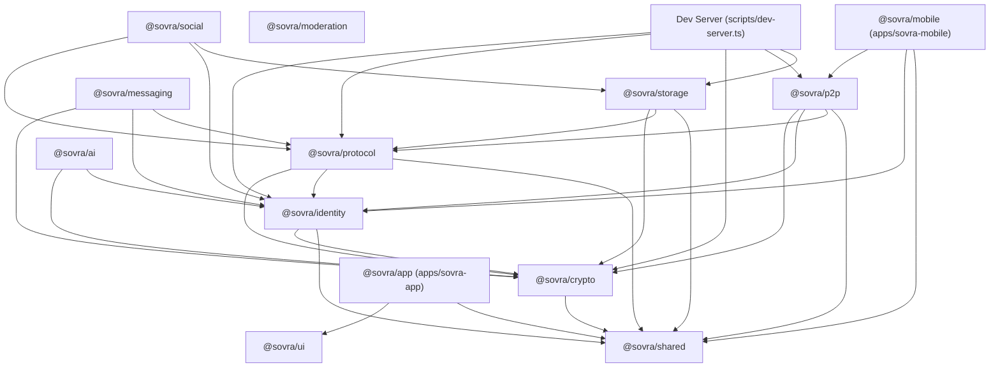

# SOVRA Source-Code Health, Functionality & Release Readiness Audit
## Deliverable 02: Architecture & Dependency Map

**Audit Date:** 2026-10-09  

---

### 1. Monorepo Package Dependency Topology



---

### 2. End-to-End User Interaction & Data Flow Architecture

#### A. Web & Mobile Client to Node Engine Flow
```text
User Interaction (Spatial Surface / Mobile Screen)
   │
   ▼
Authenticated HTTP/HTTPS Request
   │ [Headers: Authorization: Bearer <sessionToken> / Cookie / X-Sovra-DID]
   ▼
Security Gateway & Principal Resolution (resolvePrincipal / enforceAuth)
   │
   ├── [Failed Token / Missing Auth] ──► HTTP 401 Unauthorized
   ├── [Mismatched Caller DID / BOLA] ─► HTTP 403 Forbidden
   │
   ▼
Role-Based Access Control (AdminSecurityEngine / RBAC Matrix)
   │
   ▼
Business Logic & Mutation Handler (dev-server.ts)
   │
   ├── Relational Persistence ──────────► SQLite WAL (.sovra-storage-dev/sovra-social.sqlite)
   ├── Media Blobs / Videos / Images ───► Storage Daemon (Content-Addressed Blocks / IPFS CIDs)
   └── Realtime Event Dispatch ─────────► SSE Stream (/api/realtime/stream & /api/chat/stream)
```

#### B. Decentralized Offline BLE Mesh Flow
```text
Mobile Outbox Action (Post / Direct Message / Moderation Report)
   │
   ▼
Local Durable Database (SQLite / Outbox Store)
   │ [Status: LOCAL / QUEUED]
   ▼
Native BLE Platform Adapter (SovraBleModule.kt / SovraBleBridge.mm)
   │ [Request GATT MTU: 512, Rotate Nonce]
   ▼
BLE Handshake & Ephemeral Session (ble-handshake.ts)
   │ [Mutual Ed25519 Authentication + X25519 DH + ChaCha20-Poly1305 Cipher]
   ▼
Store-and-Forward Mesh Router (mesh-router.ts)
   │
   ├── Loop Suppression (Route Traversal & LRU Seen Cache)
   ├── TTL / Hop Count Enforcement (Default Max Hops: 7)
   ├── Signature & Integrity Verification (Ed25519 Envelope Verification)
   │
   ▼
Recipient Node Inbox ──► Cryptographic Delivery Receipt ──► Origin Node (ACK)
```

#### C. WebRTC E2E Calling & Media Flow
```text
Caller (Alice)                                    Callee (Bob)
   │                                                   │
   ├── Initiate Call (/api/call/offer)                 │
   │   [Authenticated Session, Blocklist Check]        │
   │                                                   │
   │                                                   ├── Poll / Receive Incoming Call
   │                                                   ├── Authorize & Answer (/api/call/answer)
   │                                                   │
   ├── Exchange ICE Candidates (/api/call/candidates) ─┤
   │   [Local Host, STUN Reflexive, or TURN Relay]    │
   │                                                   │
   ▼                                                   ▼
DTLS-SRTP PeerConnection Media Pipeline (Camera & Microphone Tracks)
   │
   ├── [Direct P2P Path Available] ──────────────────► Direct Host / Server Reflexive
   └── [Symmetric NAT / Strict Firewall] ────────────► TURN Relay Allocation (Coturn HMAC-SHA1)
```
