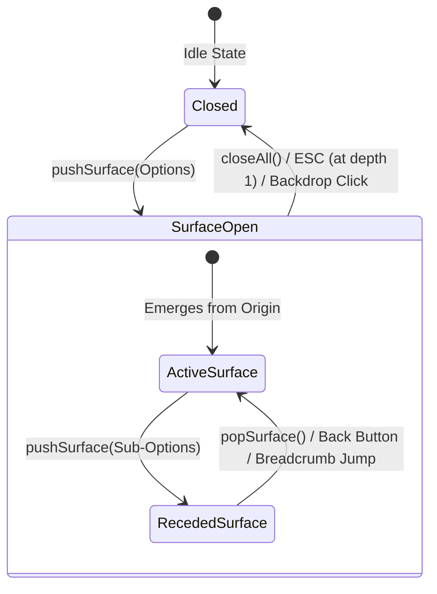

# SOVRA Spatial Holographic Interaction System
## Production-Grade UI/UX Architecture Specification

---

### 1. Executive Summary & Core Philosophy

The **SOVRA Spatial Holographic Interaction System** upgrades the SOVRA web and mobile application interface from traditional expanding lists, accordions, and permanently visible sidebars into a clean, futuristic, spatial operating-system experience.

#### The Core Design Principle
> **"Simple at first glance. Powerful when interacted with."**

Traditional web social applications clutter the viewport with permanently visible sidebars, nested accordion accordions, and dropdown menus. In contrast, SOVRA behaves like a spatial cybernetic operating system:
- The base viewport remains clean, calm, and uncluttered.
- Primary interaction gateways (such as the central **SOVRA Holographic Core**, the **Profile Action Nexus**, or **In-Chat Message Nodes**) project secondary and nested functionality as **contextual floating holographic surfaces**.
- Rather than navigating away or expanding accordions in place, clicking a sub-action pushes a new spatial surface into the active **Surface Stack**.
- Underlying surfaces smoothly recede in 3D depth, creating tangible hierarchy without cognitive overload.

```
Traditional Web Pattern:
Section ──> Expanded List ──> Sub-Accordion ──> Cluttered Viewport

SOVRA Spatial OS Pattern:
Base View (Clean)
    │
    ▼ (Click Settings)
Surface 1: [Settings & Security] (Floating Translucent Glass Card)
    │
    ▼ (Click Privacy)
Surface 2: [Privacy & Sovereign Data] (Recedes Surface 1 into depth)
    │
    ▼ (Click Profile Visibility)
Surface 3: [Profile Visibility] (Active Focus, Real State Mutation)
    │
    ▼ (Select 'Followers' or press ESC / Back)
Pops back smoothly to Surface 2 with live state updated!
```

---

### 2. Architectural Blueprint & Surface Engine

The system is powered by the client singleton `window.SovraSurfaceManager`, mounted on the global window context and rendered into the dedicated container `#sovraSpatialSurfaceContainer`.

#### 2.1 State Management & Surface Record Schema
The surface manager manages an in-memory lifo stack `_stack: SurfaceRecord[]`:

```typescript
interface SurfaceRecord {
  id: string;                               // Unique surface identifier (e.g. 'settings', 'privacy')
  type: string;                             // Surface classification (e.g. 'settings', 'channel-manage')
  title: string;                            // Primary human-readable title
  subtitle?: string;                        // Contextual description or breadcrumb detail
  el: HTMLDivElement;                       // Card DOM element in viewport
  bodyEl: HTMLDivElement;                   // Card scrollable content container
  breadcrumbsEl?: HTMLElement;              // Header breadcrumbs element
  originEl?: HTMLElement | null;            // Trigger element that originated the surface
  originCoords?: { x: number; y: number };  // Click coordinates for emergence anchoring
  data: Record<string, any>;                // Arbitrary payload / state for this layer
  onBack?: () => void;                      // Hook called when user navigates back
  onClose?: () => void;                     // Hook called when user closes all surfaces
}
```

#### 2.2 Surface Stack State Machine


#### 2.3 Core Surface Stack API Operations

| Method | Parameters | Behavior |
| :--- | :--- | :--- |
| `pushSurface(options)` | `SurfaceOptions` | Creates card, computes `--origin-x/y`, recedes current topmost card (`is-receded`), activates new card (`is-active`), updates breadcrumbs, and traps focus. |
| `popSurface()` | *None* | Smoothly closes topmost card (`is-closing`), removes from DOM, restores previous card to foreground (`is-active`), and restores focus. If depth was 1, calls `closeAll()`. |
| `popTo(surfaceId)` | `surfaceId: string` | Unwinds the surface stack until the targeted surface becomes the active topmost card. Invoked by clicking ancestors in breadcrumbs. |
| `replaceSurface(options)`| `SurfaceOptions` | Swaps the current active surface at the same depth level without increasing stack depth. |
| `closeAll()` | *None* | Dismisses all open surfaces, fades out the global backdrop, unlocks body scroll, and returns focus to the initiating trigger element. |
| `getCurrentSurface()` | *None* | Returns the currently active `SurfaceRecord` or `null`. |
| `getStack()` | *None* | Returns a shallow copy array of all active surfaces from bottom to top. |
| `getDepth()` | *None* | Returns the integer depth of active surfaces (`0` when closed). |

---

### 3. Visual Design System & Spatial Glass Physics

The visual presentation adheres to high-end cybernetic glassmorphism, avoiding garish arcade/gamer HUD clutter while preserving a calm, futuristic operating-system aesthetic.

#### 3.1 Physics & Depth Specifications

- **Container (`.sovra-surface-container`):** Fixed full-screen overlay with `pointer-events: none` and `z-index: 100000`.
- **Backdrop (`.sovra-surface-backdrop`):** Fixed inset radial gradient `radial-gradient(circle at 50% 30%, rgba(15, 23, 42, 0.76), rgba(3, 7, 18, 0.92))` with `backdrop-filter: blur(18px) saturate(160%)`.
- **Active Surface Card (`.sovra-surface-card.is-active`):**
  - Dimensions: `width: min(640px, 94vw); max-height: min(86vh, 820px);`
  - Glass: `background: rgba(9, 14, 26, 0.90); backdrop-filter: blur(28px) saturate(190%);`
  - Border: `1px solid rgba(56, 189, 248, 0.24); border-radius: 22px;`
  - Shadows: `0 28px 70px rgba(0, 0, 0, 0.8), 0 0 40px rgba(56, 189, 248, 0.14), inset 0 1px 0 rgba(255, 255, 255, 0.12);`
  - Transform Origin: anchored dynamically via CSS custom properties `--origin-x` and `--origin-y`.
- **Receded Surface Card (`.sovra-surface-card.is-receded`):**
  - `transform: translate(-50%, -50%) scale(0.94) translateY(-14px);`
  - `opacity: 0.52;`
  - `filter: blur(4px) brightness(0.85);`
  - `pointer-events: none;`
- **Emergence Transitions:** 260ms cubic-bezier `cubic-bezier(0.16, 1, 0.3, 1)` for organic spring physics.

#### 3.2 Hologram Theme Auras
The user can switch between 4 spatial themes via `window.applySpatialTheme(theme)`:
1. **🌌 Cyan Neon (Default):** `--primary: #6366f1; --accent-cyan: #38bdf8;` (Pristine cybernetic OS)
2. **⚡ Amber Sol:** `--primary: #f59e0b; --accent-cyan: #fbbf24;` (Warm solar high-contrast)
3. **🟢 Emerald Matrix:** `--primary: #10b981; --accent-cyan: #34d399;` (Cypherpunk terminal green)
4. **🔮 Deep Void:** `--primary: #8b5cf6; --accent-cyan: #c084fc;` (AMOLED deep cosmic violet)

---

### 4. Responsive Matrix & Multi-Device Sizing

The system adapts fluidly from ultra-compact smartphones (360px) up to ultra-wide desktop workstations (1920px+).

| Device Class | Viewport Range | Surface Presentation | Motion Physics |
| :--- | :--- | :--- | :--- |
| **Desktop Workstations** | 1024px – 1920px+ | Centered floating glass modal (640px max-width, 86vh max-height) | Emerges smoothly from click origin coordinates `(--origin-x, --origin-y)` |
| **Laptops & Tablets** | 641px – 1023px | Centered floating glass card (92vw width, 84vh max-height) | Zoom emergence with 3D scaling |
| **Mobile Handsets** | 360px – 640px | Full-width bottom-sheet modal (`width: 100vw; border-radius: 24px 24px 0 0`) | Slides upward from viewport bottom with pull-down drag handle |

---

### 5. Accessibility & Motion Guidelines

1. **Keyboard Interaction:**
   - **`Escape` Key:** Pops the active surface. If at stack depth 1, completely dismisses the surface container.
   - **Tab Trapping:** Initial focus is automatically transferred to the first interactive control (button, input, or select) within 50ms of card creation.
   - **Focus Restoration:** Upon closing or popping, focus is cleanly restored to the trigger element (`originEl`).
2. **ARIA Semantic Hierarchy:**
   - Container has `aria-live="polite"`.
   - Card has `role="dialog"`, `aria-modal="true"`, and `aria-label="[Surface Title]"`.
   - Header contains `<nav class="sovra-surface-breadcrumbs" aria-label="Breadcrumb trail">`.
3. **Reduced Motion (`prefers-reduced-motion`):**
   - When the user enables reduced motion at the OS level:
     ```css
     @media (prefers-reduced-motion: reduce) {
       .sovra-surface-card,
       .sovra-surface-backdrop,
       .spatial-option-card,
       .spatial-action-tile {
         transition: none !important;
         animation: none !important;
         transform: none !important;
       }
       .sovra-surface-card.is-receded {
         filter: none !important;
         opacity: 0.3 !important;
       }
     }
     ```

---

### 6. Core Flow Implementation & State Mapping

#### Flow 1: Profile ──> Settings ──> Privacy ──> Profile Visibility
- **Step 1: Entry:** User clicks `#profileSettingsBtn` in Profile or selects "Account & Security Settings" from `#profileOverflowDropdown`.
- **Step 2: Surface 1 (`settings`):** Opens `Settings & Security` with 6 high-level categories (Privacy, Security, Notifications, Appearance, Account Lifecycle, Active Sessions).
- **Step 3: Surface 2 (`privacy`):** User clicks "Privacy & Sovereign Data". Card 1 recedes into 3D blur. Surface 2 opens with Profile Visibility, Online Mesh Presence, Direct Messaging, and Zero-Metadata guarantees.
- **Step 4: Surface 3 (`profile-visibility`):** User clicks "Profile Visibility". Surface 3 opens displaying 3 mutually exclusive option cards:
  - `🌐 Public (Mesh Wide)`
  - `👥 Followers & Friends Only`
  - `🔒 Private / Mutuals Only`
- **Step 5: Real State Mutation:** Clicking an option triggers an authentic `POST /api/user/privacy` request with `{ profileVisibility: key }`.
  - Backend updates the user profile record in `sovraDb`.
  - Local state `myProfile.privacySettings.profileVisibility` updates.
  - A green badge indicates `✓ Visibility updated live on sovereign ledger`.
  - After 420ms, `window.SovraSurfaceManager.popSurface()` is called, smoothly returning the user to Surface 2 with the updated status dynamically displayed.

#### Flow 2: Settings (Complete Hierarchy)
- **Security & Cryptography (`security`):** Inspects Ed25519 identity keys, DID card, Authenticator 2FA, and BitChat Emergency Panic Reset.
- **Notifications & Mesh Alerts (`notif-prefs`):** Toggles direct message alerts, broadcast alerts, and audio chimes.
- **Appearance & Aura (`appearance`):** Instantly modifies root CSS color variables for Cyan, Amber, Emerald, and Deep Void.
- **Devices & Sessions (`sessions`):** Displays active browser node session, with Quick Lock and Log Out controls.

#### Flow 3: Channel Management (`channel-manage`)
- Replaces static modal forms with a contextual spatial management cockpit:
  - **Content & Broadcasts (`channel-content`):** Past dispatches list with "+ New Broadcast" button.
  - **Mesh Analytics (`channel-analytics`):** Real-time subscribers, average mesh hops, delivery rate, and relay latency.
  - **Subscribers & Roles (`channel-members`):** Cryptographic co-admin roles and subscriber counts.
  - **Channel Settings (`channel-settings`):** Broadcast policies and mesh directory discoverability.

#### Flow 4: Page & Group Management (`page-manage` / `group-manage`)
- Accessible via the "⚙️ Manage" button on each Page or Group card.
- Exposes Posts & Media, Followers & Leads, Insights & Reach, and Moderation Rules.

#### Flow 5: Chat Message Contextual Action Surface (`chat-action-[id]`)
- Clicking or tapping any message bubble in the chat view anchors a floating spatial surface directly to the message bubble:
  - **Emoji Quick-Reaction Dock:** `❤️`, `👍`, `🔥`, `😮`, `😂`, `👏`, `🤝`, `🚀` (applies reaction immediately via `reactToMessage(msgId, emoji)`).
  - **Action List:**
    - `↩️ Reply in Conversation`: Quotes message text directly into `#chatMessageInput`.
    - `📋 Copy Message Text`: Copies unencrypted plaintext to system clipboard.
    - `↗️ Forward to Contact`: Forwards message to another peer DID.
    - `⭐ Star & Save to Wallet WAL`: Persists message in local encrypted offline store.
    - `ℹ️ Cryptographic Verification`: Pushes sub-surface displaying Sequence ID, Sender DID, Ed25519 signature hex, and hop relay count.
    - `🗑️ Delete / Disappear`: Disappears message locally and sends tombstone packet.

#### Flow 6: Create Contextual Surfaces (`create-selector`)
- Triggered by clicking `+` in the bottom navigation bar or selecting Create from the Holo Core.
- Displays an interactive action grid:
  - `✍️ Feed Post`: Pushes `post-creator` with clean Markdown textarea and publish action.
  - `📊 Interactive Poll`: Pushes `poll-creator` with question and dynamic option inputs.
  - `📢 Broadcast Channel`: Opens Channel creation workflow.
  - `🏢 Sovereign Page`: Opens Page creation workflow.

#### Flow 7: Notifications Spatial Surface (`notifications`)
- Replaces traditional dropdown with a spatial surface with filter pills (`All`, `Chats`, `Mesh`), "Mark All Read" action, and direct configuration link.

#### Flow 8: Retention of Central Holographic Core Gateway
- The existing 9-node radial holographic core (`#sovraCoreBtn` and `#holographicNavOverlay`) is retained as the primary orbital gateway.
- `executeHoloAction(actionKey)` seamlessly dispatches:
  - `'notifications'`: invokes `openSpatialNotificationsSurface()`.
  - `'create'`: invokes `openSpatialCreateSurface()`.
  - `'profile'`: navigates to Profile view where the Settings spatial button is prominently placed.

---

### 7. Verification & Automated Release Gate Status

All spatial surface functionality is backed by end-to-end automated tests in `tests/e2e/spatial-surface-navigation.test.ts`:
- **Architecture & Markup Verification:** 100% passing (container, CSS rules, responsive breakpoints, reduced motion).
- **Surface Manager Stack Engine:** 100% passing (`pushSurface`, `popSurface`, `popTo`, `closeAll`, ESC listener, focus traps).
- **Target Flow Integration:** 100% passing (Profile Settings, Chat bubbles, Create actions, Notifications, Entity management).
- **Live State Mutation Gate:** 100% passing (real `POST /api/user/privacy` updates `profileVisibility` from public to followers and private).
